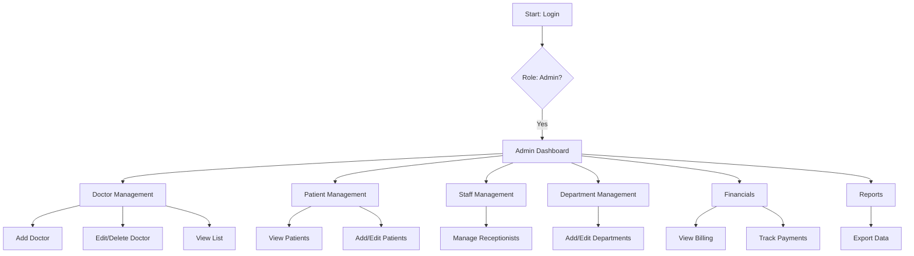
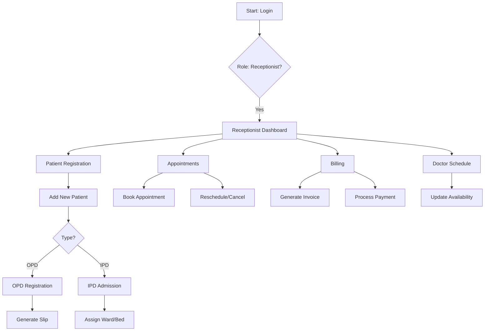
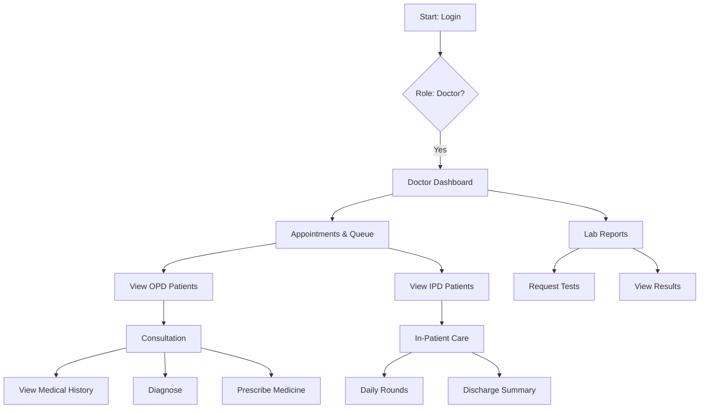
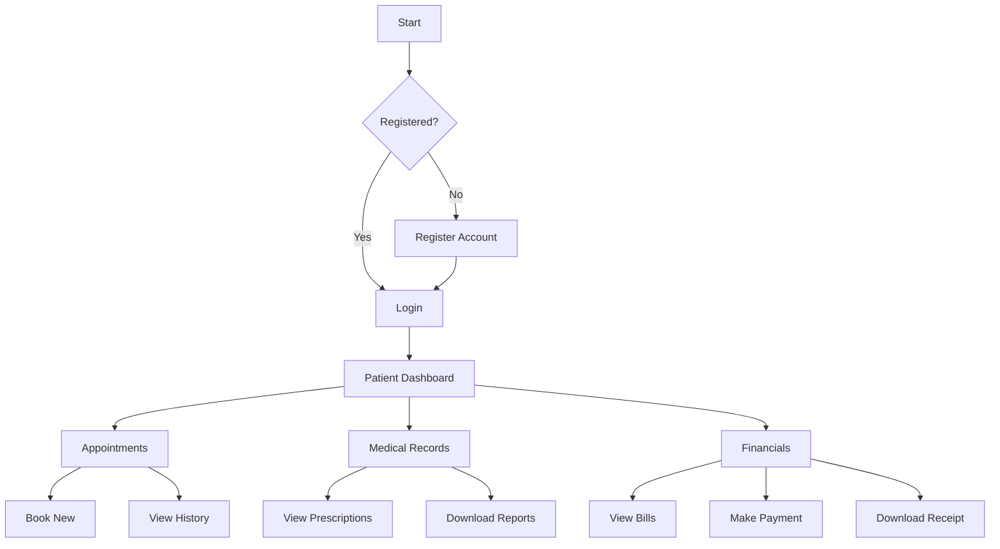

# Hospital Management System - Flowcharts

This document provides visual representations of the system's workflows for each user role.

## 1. Admin Workflow
Managing the overall hospital ecosystem: doctors, patients, staff, and finances.

## 2. Receptionist Workflow
Handling patient registration, appointments, and billing.

## 3. Doctor Workflow
Clinical operations: consultations, prescriptions, and patient care.

## 4. Patient Workflow
Patient self-service portal.

